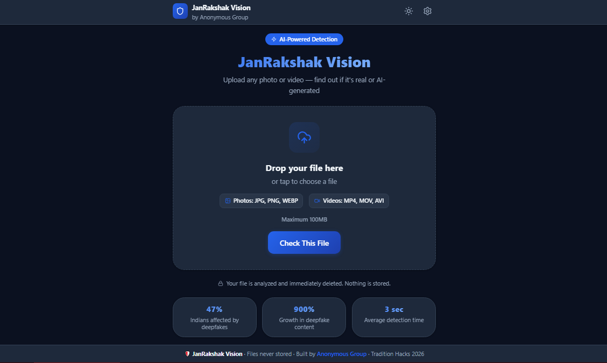
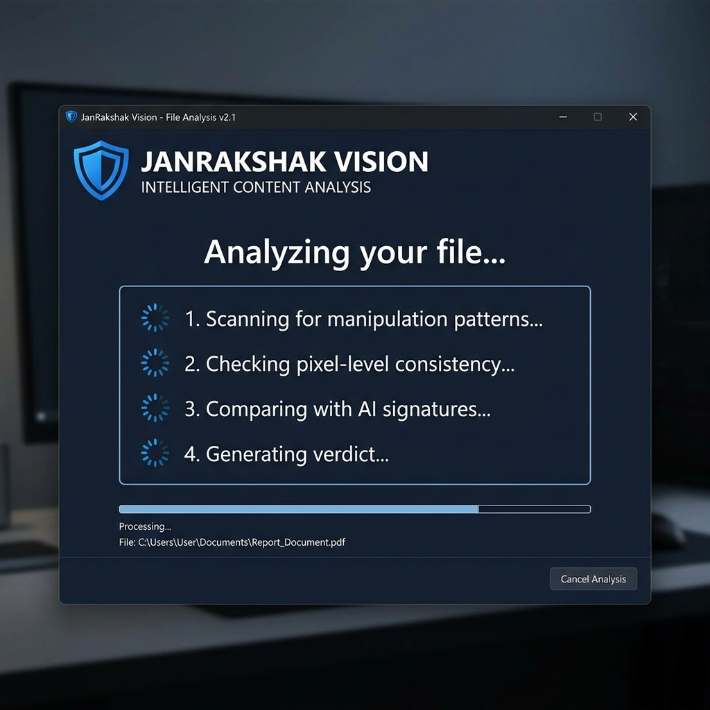

<div align="center">



# 🛡️ JanRakshak Vision

### *People's Guardian Eye — AI-Powered Deepfake Detector for Everyone*

**Instantly detect AI-generated images, deepfake videos, and manipulated media — in seconds, in your language, for free.**

[](https://janrakshak-frontend.vercel.app)
[](https://ofc01-janrakshak-api.hf.space)
[](#)
[](LICENSE)
[-ef4444?style=for-the-badge)](#)

</div>

---

## 🚨 The Problem — Why JanRakshak Vision Exists

India is facing an **unprecedented crisis** of AI-powered fraud and deepfakes. According to McAfee India (2025), **47% of Indians** have been targeted by AI/deepfake scams — nearly **twice the global average**. In 2025, cybercrime losses reached **₹22,495 crore** (Govt of India official data).

### 📋 Real Documented Incidents (2024–2026)

| Category | High-Profile Incidents |
|---|---|
| **Digital Arrests (Epidemic)** | MHA reports **7,061 victims** lost **₹120.30 crore** in just 3 months of early 2024. Scammers deepfake CBI/Police officers in live video calls. By 2025, scale has multiplied dramatically. |
| **Corporate Fraud** | A multinational company lost **$25 million** when attackers deepfaked the CFO's face/voice in a Zoom call (2025). |
| **Celebrity Endorsement Scams** | Viral deepfake videos of Mukesh Ambani and Virat Kohli endorsing fake trading apps — defrauding thousands monthly. |
| **Family Voice Cloning** | Fraudsters clone 3–10 seconds of audio from social media and call relatives claiming emergencies. Multiple ₹10–50 lakh losses documented. |
| **Image Abuse** | **1,200+ cases** of AI-morphed intimate images used for blackmail (NCRB data). |
| **AI DaaS** | Deepfake-as-a-Service tools available for ₹500–2,000, collapsing the barrier to entry completely. |

> **Human deepfake detection accuracy is only 24.5%** — essentially random guessing. JanRakshak Vision exists to protect the most vulnerable: senior citizens, rural users, and non-English speakers.

### ⚖️ India IT Rules 2026 Compliance

Effective **February 20, 2026**, the new IT Amendment Rules mandate:
- **2-Hour Takedown:** Platforms must remove flagged deepfakes within 2 hours.
- **Mandatory SGI Labeling:** AI-generated content must be labeled/watermarked.
- **Safe Harbour Loss:** Non-compliant platforms lose Section 79 protection.

*JanRakshak Vision empowers citizens to detect and report SGI content to National Helpline **1930** and cybercrime.gov.in, fully aligned with IT Rules 2026.*

---

## 💡 What It Does

JanRakshak Vision is a **zero-friction deepfake detection platform** — no account, no app download, no technical knowledge required.

```
Anyone → Upload photo or video → Get plain-language verdict in 8–15 seconds
```

### Verdict System
| Result | Meaning | Action |
|---|---|---|
| ✅ **REAL** | No AI signatures detected | Safe to share |
| ⚠️ **SUSPICIOUS** | Partial manipulation detected | Verify before sharing |
| ❌ **FAKE** | Strong AI generation/deepfake markers found | Do not share — report to cybercrime.gov.in |

---

## 🖥️ App Preview

<div align="center">

<br/><em>Home Screen — Simple drag-and-drop upload, no login needed</em>

<br/><br/>


<br/><em>Analysis Screen — Real-time progress with AI model status</em>
</div>

---

## 🗺️ System Architecture


<br/><em>Project Architecture Diagram made by Miro.</em>


```
┌─────────────────────────────────────────────────────────────────┐
│                    USER DEVICE (Mobile / PC)                     │
│           React 18 + Vite — Hosted on Vercel Edge CDN           │
│           Languages: English | हिन्दी | বাংলা                   │
└──────────────────────────┬──────────────────────────────────────┘
                           │ HTTPS POST /analyze/image or /analyze/video
                           ▼
┌─────────────────────────────────────────────────────────────────┐
│        FastAPI Backend — HuggingFace Spaces (Docker, CPU)        │
│        Rate Limit: 10 req/min (images) | 5 req/min (videos)     │
│                                                                  │
│  ┌──────────────────┐ ┌──────────────────┐ ┌─────────────────┐  │
│  │ Brain 1: Gen-AI  │ │ Brain 2: Texture │ │ Brain 3: Edits  │  │
│  │ Expert [35%]     │ │ Expert [35%]     │ │ Expert [30%]    │  │
│  │ Midjourney/DALLE │ │ Pixel anomalies  │ │ Face-swaps/PS   │  │
│  └────────┬─────────┘ └────────┬─────────┘ └────────┬────────┘  │
│           └──────────────┬─────┴──────────────────── ┘          │
│                          ▼                                       │
│              ┌───────────────────────────┐                       │
│              │  Smart Heuristic Engine   │                       │
│              │  • High-Confidence Boost  │                       │
│              │  • Composite Floor        │                       │
│              │  • Screenshot Filter      │                       │
│              └──────────────┬────────────┘                       │
│                             │ del + gc.collect() [Zero Storage]  │
└─────────────────────────────┼───────────────────────────────────┘
                              │ JSON Response
                              ▼
          { verdict, confidence, fake_score, real_score,
            explanation: { en, hi, bn }, model_votes[] }
```

**Privacy Guarantee:** All processing is RAM-only. Nothing written to disk (except temp video files, immediately deleted). No database, no logs, no user data collected.

---

## 🧠 The "3-Brain" AI Ensemble (v7) + Smart Heuristic Engine

We use a **Weighted Multi-Model Ensemble** running 3 specialized AI "Brains" in parallel:

| Brain | Model | Weight | Specialization |
|---|---|---|---|
| 🧠 **Brain 1** | `haywoodsloan/ai-image-detector-deploy` | **35%** | Generative AI (Midjourney, DALL-E 3, SDXL, Gemini) |
| 🧠 **Brain 2** | `Organika/sdxl-detector` | **35%** | Pixel noise, texture artifacts, impossible lighting |
| 🧠 **Brain 3** | `umm-maybe/AI-image-detector` | **30%** | Composites, face-swaps, Photoshop manipulation |

### The Smart Heuristic Engine (Post-Model Logic)
- 🚀 **High-Confidence Amplifier:** Any single model >85% Fake → boost final score. Threats can't be averaged away.
- 🛡️ **Composite Protection Floor:** Brain 3 ≥70% → floor verdict to minimum SUSPICIOUS. Dangerous edits are *never* marked safe.
- 🖼️ **Dual-Signal Screenshot Filter:** Before inference, checks 256×256 thumbnail for (1) unique color count <2,000 AND (2) pixel std-dev <15. Both must agree before dampening fake score by 60%. Prevents false positives on dark/compressed photos.

---

## 🏗️ Full Tech Stack

| Layer | Technology |
|---|---|
| **Frontend Framework** | React 18 + Vite |
| **Styling** | Vanilla CSS with CSS Variables (7 color themes, dark/light mode) |
| **Internationalization** | `react-i18next` — English, हिन्दी (Hindi), বাংলা (Bengali) |
| **File Handling** | `react-dropzone` — images (JPG/PNG/WEBP/GIF/BMP) + videos (MP4/AVI/MOV/MKV) |
| **Frontend Hosting** | Vercel Edge Network (auto-deploys from GitHub `main`) |
| **Backend Framework** | FastAPI (Python 3.10) + Uvicorn |
| **AI Models** | Hugging Face `transformers` pipeline (3 models preloaded at startup) |
| **Image Processing** | Pillow (`PIL`) + `ImageStat` for heuristic analysis |
| **Video Processing** | `opencv-python-headless` — frame extraction |
| **Rate Limiting** | `slowapi` — 10/min images, 5/min videos per IP |
| **Backend Hosting** | Hugging Face Spaces (CPU tier, Dockerized, free) |

---

## 📖 User Guide

**Step 1:** Open [janrakshak-frontend.vercel.app](https://janrakshak-frontend.vercel.app)  
**Step 2:** Choose language (⚙️ settings) — EN, हिन्दी, or বাংলা  
**Step 3:** Upload photo/video via drag-and-drop or tap to browse  
**Step 4:** Tap **"Check This File"** and wait 8–15 seconds (images) or 30–60 seconds (videos)  
**Step 5:** Share result or report to [cybercrime.gov.in](https://cybercrime.gov.in) if fake detected

> **Note:** The backend runs on HuggingFace free tier. If the API has been idle, the first request may take 30–90 seconds to wake up (cold start). Subsequent requests are fast.

---

## 🔬 API Reference (For Developers)

**Base URL:** `https://ofc01-janrakshak-api.hf.space`  
**Interactive Docs:** `https://ofc01-janrakshak-api.hf.space/docs`

```bash
# Health Check
curl https://ofc01-janrakshak-api.hf.space

# Analyze an Image (max 50MB)
curl -X POST https://ofc01-janrakshak-api.hf.space/analyze/image \
     -F "file=@your_image.jpg"

# Analyze a Video (max 100MB)
curl -X POST https://ofc01-janrakshak-api.hf.space/analyze/video \
     -F "file=@your_video.mp4"
```

**Image Response:**
```json
{
  "verdict": "FAKE",
  "confidence": 88,
  "fake_score": 0.8842,
  "real_score": 0.1158,
  "explanation": {
    "en": "This image shows 88% signs of AI generation...",
    "hi": "इस तस्वीर में 88% AI निर्माण के संकेत हैं...",
    "bn": "এই ছবিতে 88% AI তৈরির লক্ষণ রয়েছে..."
  },
  "model_votes": [
    { "name": "detector_v2", "fake_score": 0.95, "verdict": "FAKE", "confidence": 95 },
    { "name": "sdxl",        "fake_score": 0.82, "verdict": "FAKE", "confidence": 82 },
    { "name": "general",     "fake_score": 0.85, "verdict": "FAKE", "confidence": 85 }
  ]
}
```

**Rate Limits:** 10 requests/min per IP (images) · 5 requests/min per IP (videos)  
**Error Codes:** 400 (invalid file) · 413 (too large) · 415 (wrong type) · 429 (rate limit) · 503 (cold start)

---

## 🌍 Future Roadmap

| Phase | Timeline | Goal |
|---|---|---|
| **Phase 1** | Q3 2026 | Stabilization, parallel inference, scaling to 10K+ daily users |
| **Phase 2** | Q4 2026 | Browser Extension — WhatsApp Web, Twitter/X, Facebook auto-verify |
| **Phase 3** | 2027 | Audio Deepfake Detection (voice cloning scams) |
| **Phase 4** | 2027 | WhatsApp Bot — forward any suspicious image for instant check |
| **Phase 5** | 2028 | Offline Mobile App — React Native, quantized models, no internet required |

---

## 👥 Team — Anonymous Group

**Tradition Hacks 2026** | Building technology for India's most vulnerable

| Member | Role | Contribution |
|---|---|---|
| **Kushal Soni** | **Team Leader / Full-Stack & AI Lead** | Frontend UI/UX (7 themes, i18n, drag-drop), FastAPI backend, "3-Brain" ensemble, Heuristic Engine v7, Zero-Storage pipeline, rate limiting, video analysis |
| **Vinod Kumar Prajapat** | QA & Presentation Lead | Miro architecture diagrams, QA & edge-case testing (screenshot false-positive → dual-signal filter), presentation materials |
| **Vishal Vishwakarma** | Member | — |

---

## 📄 License

MIT License — Free to use, modify, and distribute with attribution.

<div align="center">

**🛡️ JanRakshak Vision** — *Protecting every Indian from AI-powered deception*

[Live App](https://janrakshak-frontend.vercel.app) · [API](https://ofc01-janrakshak-api.hf.space) · [API Docs](https://ofc01-janrakshak-api.hf.space/docs) · [Report Issue](https://github.com/kushal-soni-official/janrakshak-vision/issues)

*Built with ❤️ for Tradition Hacks 2026 — Anonymous Group | Leader: Kushal Soni*

</div>
