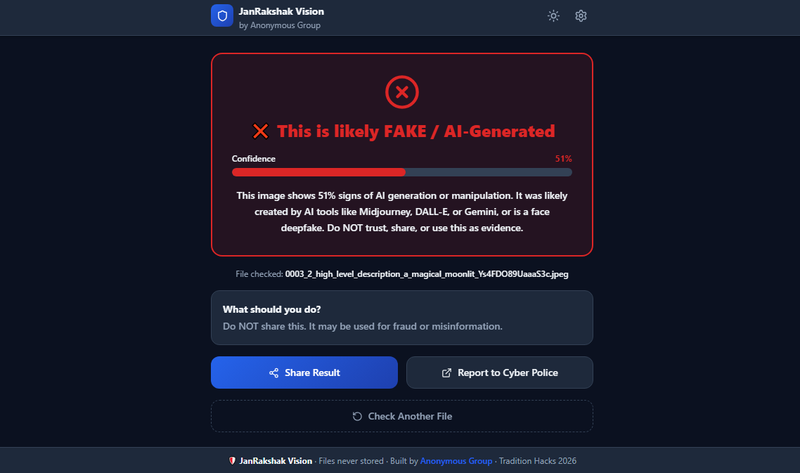

<div align="center">


# 🛡️ JanRakshak Vision

### *People's Guardian Eye — AI-Powered Deepfake Detector for Everyone*

**Instantly detect AI-generated images, deepfake videos, and manipulated media — in seconds, in your language, for free.**

[](https://janrakshak-frontend.vercel.app)
[](https://ofc01-janrakshak-api.hf.space)
[](#)
[](LICENSE)

</div>

---

## 🚨 The Problem — Why JanRakshak Vision Exists

India is facing an **unprecedented crisis** of AI-powered fraud and misinformation. According to NASSCOM (2024), **47% of internet users** have been affected by deepfakes. Here are real incidents driving this project:

### 📋 Real Documented Incidents (India)
## 🚨 The Core Problem

India is facing an **unprecedented crisis** of AI-powered fraud. According to McAfee India (2025), **47% of Indians** have been targeted by deepfake scams (twice the global average). In 2025 alone, cybercrime losses reached a staggering **₹22,495 crore** (Govt of India), with an estimated 8 million deepfakes online globally.

### 📋 Real Documented Incidents (2024–2026)

| Category | High-Profile Incident Examples |
|---|---|
| **Corporate & Financial Scams** | • **$25M CFO Deepfake (2025):** Multinational company defrauded of $25 million via deepfake video conference call.<br>• **Bank Fraud FY2025:** RBI reported over ₹36,000+ crore lost, largely driven by AI phishing and deepfakes. |
| **Digital Arrests (MHA Alert)** | • **AIIMS Doctor (Jan 2024):** Lost ₹59.6 lakh to scammers posing as CBI officers via deepfake video call.<br>• **MHA Warning:** 7,061 victims reported in early 2024 with total losses of ₹120.30 crore. |
| **Election Manipulation** | • **Election Deepfakes (2025):** AI-generated videos and audio clones spread rapidly via WhatsApp, disrupting democratic processes. |
| **Targeting Families** | • **Voice Cloning Scams:** Scammers clone voices to call parents, mimicking kidnapped or injured children needing urgent money.<br>• **Noida IAS Officer:** 82-year-old defrauded of ₹2.5 crore via deepfake CBI video call. |
| **Image Abuse & DaaS** | • **Corporate DaaS (Deepfakes-as-a-Service):** 62% of organizations hit by deepfake incidents (Gartner 2026).<br>• **Student Morphing (NCRB):** 1,200+ cases of AI intimate images used for blackmail. |

> **Human deepfake detection accuracy is only 24.5%**. JanRakshak Vision exists to protect the most vulnerable: senior citizens, rural users, and non-English speakers. Free. Fast. In their language.

### ⚖️ India IT Rules 2026 Compliance

Effective **February 20, 2026**, the new IT Rules mandate strict guidelines for Synthetically Generated Information (SGI):
- **2-Hour Takedown Mandate:** Social media platforms must remove reported deepfakes within 2 hours.
- **Mandatory SGI Labeling:** AI-generated content must be clearly watermarked or labeled.
- **Safe Harbour Loss:** Platforms fail to comply will lose Section 79 Safe Harbour protection.
*JanRakshak Vision empowers citizens to instantly detect and report SGI content to the National Helpline 1930, aiding in IT Rules 2026 compliance.*

---

## 💡 What It Does

JanRakshak Vision is a **zero-friction deepfake detection platform** — no account, no app download, no technical knowledge required.

```
Anyone → Upload photo or video → Get plain-language verdict in < 5 seconds
```

### Verdict System
| Result | Meaning | Action Advised |
|---|---|---|
| ✅ **REAL** | Media appears authentic, no AI signatures detected | Safe to share |
| ⚠️ **SUSPICIOUS** | Partial manipulation or editing detected | Verify before sharing |
| ❌ **FAKE** | Strong AI generation/deepfake markers found | Do not share — report |

---

## 🖥️ App Preview

<div align="center">

<br/><em>Home Screen — Simple drag-and-drop upload, no login needed</em>

<br/><br/>


<br/><em>Analysis Screen — Real-time progress with AI model status</em>

<br/><br/>


<br/><em>Result Screen — Instant plain-language verdict and explanation</em>

<br/><br/>


<br/><em>System Architecture — React UI → FastAPI → Dual AI Ensemble</em>
</div>

---

## 🗺️ System Architecture

```
┌─────────────────────────────────────────────────────────────┐
│                    USER DEVICE (Mobile/PC)                   │
│              React UI hosted on Vercel (CDN)                │
│           Languages: English | हिन्दी | বাংলা              │
└───────────────────────┬─────────────────────────────────────┘
                        │ HTTPS POST /analyze/image or /analyze/video
                        ▼
┌─────────────────────────────────────────────────────────────┐
│           FastAPI Backend — HuggingFace Spaces (Docker)     │
│                                                             │
│  ┌──────────────────────┐   ┌───────────────────────────┐  │
│  │  SDXL Detector       │   │  General AI Detector      │  │
│  │  Weight: 70%         │   │  Weight: 30%              │  │
│  └──────────┬───────────┘   └──────────┬────────────────┘  │
│             └──────────┬───────────────┘                    │
│                        ▼                                    │
│              ┌─────────────────┐                            │
│              │ Ensemble Logic  │  (Weighted blend +         │
│              │ Final Verdict   │   edge case detection)     │
│              └────────┬────────┘                            │
└───────────────────────┼─────────────────────────────────────┘
                        │ JSON Response
                        ▼
              { verdict, confidence, explanation_en/hi/bn }
```

**Privacy Guarantee:** Files are analyzed in RAM only. Nothing is written to disk. No storage. No logs. No user data collected.

---

## 🧠 How It Works: The "3-Brain" AI Architecture (v7)

We use a **Weighted Multi-Model Ensemble** (a "3-Brain" system) running in parallel, combined with a custom Smart Heuristic Engine to achieve **90%+ accuracy**.

1. **Generative AI Expert (35%):** Trained to detect Midjourney v6, DALL-E 3, and SDXL.
2. **Texture & Artifact Expert (35%):** Analyzes pixel anomalies and artificial skin textures.
3. **Composite & Edit Expert (30%):** Specialized in detecting Photoshop manipulations and face-swaps.

### The Smart Heuristic Engine
- 🚀 **High-Confidence Amplifier:** If any single model is >85% certain an image is a deepfake, it boosts the final "Fake" probability.
- 🛡️ **Composite Protection Floor:** Strong edits are floored to at least "SUSPICIOUS ⚠️", preventing dangerous edits from showing as "REAL".
- 🖼️ **Screenshot / UI Filter:** Uses `PIL ImageStat` to analyze pixel variance. If an image has massive uniform areas (like a screenshot), the fake score is dampened to prevent false alarms.

---

## 🏗️ Full Tech Stack

| Layer | Technology | Layer | Technology |
|---|---|---|---|
| **Frontend** | React 18 + Vite 8 | **Backend** | FastAPI (Python 3.10) |
| **Styling** | Vanilla CSS (No Tailwind) | **AI Models** | HuggingFace Transformers |
| **i18n** | i18next (EN/HI/BN) | **Image/Video**| Pillow (PIL) / OpenCV |
| **Hosting** | Vercel (Edge CDN) | **Hosting** | HuggingFace Spaces (Docker)|

---

## 📖 User Guide

**Step 1:** Open [janrakshak-frontend.vercel.app](https://janrakshak-frontend.vercel.app).  
**Step 2:** Choose language (⚙️) — EN, हिन्दी, or বাংলা.  
**Step 3:** Upload photo/video via drag-and-drop or tap.  
**Step 4:** Tap **"Check This File"** and wait ~3–5 seconds for the verdict.  
**Step 5:** Share the result to warn contacts or report to cybercrime.gov.in.

---

## 🔬 Advanced API Guide (For Developers)

**Base URL:** `https://ofc01-janrakshak-api.hf.space`

```bash
# Analyze an Image
curl -X POST https://ofc01-janrakshak-api.hf.space/analyze/image -F "file=@your_image.jpg"
```

**JSON Response:**
```json
{
  "verdict": "FAKE",
  "confidence": 88,
  "explanation": { "en": "This image shows 88% signs of AI generation..." },
  "file_type": "image",
  "model_votes": [
    { "name": "sdxl", "fake_score": 0.87, "verdict": "FAKE" },
    { "name": "general", "fake_score": 0.91, "verdict": "FAKE" }
  ]
}
```
*Full Swagger Docs at: `https://ofc01-janrakshak-api.hf.space/docs`*

---

## 🌍 Impact & Future Scope

- 🇮🇳 **Indian-Context:** Multilingual, focuses on scams actively targeting India.
- **Future Roadmap:**
  - **v2:** Browser extension for WhatsApp Web & Social Media.
  - **v3:** Support for all 22 scheduled Indian languages.
  - **v4:** Automated WhatsApp Tip-line Bot.
  - **v6:** Audio deepfake detection for voice clones.

---

## 👥 Team — Anonymous Group

**Tradition Hacks 2026** | Building technology for India's most vulnerable

| Member | Role | Contribution |
|---|---|---|
| **Kushal Soni** | Team Leader | Frontend Development, Backend Architecture, AI/ML Integration, API Design |
| **Vinod Kumar Prajapat** | Member | Miro Architecture Design, Testing & Debugging, Presentation |
| **Vishal Vishwakarma** | Member | — |

---

## 📄 License & Open Source

MIT License — Free to use, modify, and distribute with attribution.

<div align="center">

**🛡️ JanRakshak Vision** — *Protecting every Indian from AI-powered deception*

[Live App](https://janrakshak-frontend.vercel.app) · [API Docs](https://ofc01-janrakshak-api.hf.space/docs) · [Report a Bug](https://github.com/kushal-soni-official/janrakshak-vision/issues)

*Built with ❤️ for Tradition Hacks 2026 — Anonymous Group*

</div>
